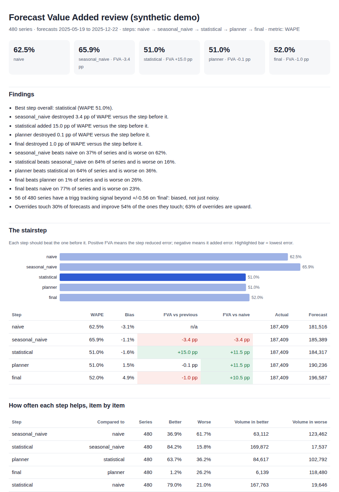

# forecast-value-added

**Forecast value added (FVA) analysis and demand classification for demand planners.** Did your forecasting process, and your manual overrides, actually beat a naive forecast?

[](https://github.com/msachet5/forecast-value-added/actions/workflows/ci.yml)
[](https://pypi.org/project/forecast-value-added/)
[](https://pypi.org/project/forecast-value-added/)
[](LICENSE)

```bash
pip install forecast-value-added
fva demo            # full report on synthetic data, no setup
fva report sales.csv --forecasts forecasts.csv --steps naive,statistical,final
```



## Why this exists

Every S&OP meeting reviews forecast accuracy. Very few ask the question that matters: **did each step of the process make the forecast better than the step before it?** That question has a name, forecast value added, and a standard report, the FVA stairstep. Yet no maintained open-source package computes it.

Open-source forecasting libraries (statsforecast, sktime, darts) are excellent at producing forecasts. They do not tell a planning team whether its statistical model beats seasonal naive, whether planner overrides add value, or which demand classes deserve which accuracy target. This library is that planner layer, and it works on top of any forecasting tool, including your ERP's.

## What it does

| Question a planning team asks | Function | CLI |
|---|---|---|
| Which items are smooth, erratic, intermittent or lumpy? | `demand_profile` (Syntetos-Boylan ADI / CV²) | `fva classify` |
| Which items carry the value, and which are predictable? | `abc_xyz`, `abc_xyz_matrix` | `fva classify` |
| How would naive, seasonal naive, SES, Croston, TSB have done? | `backtest` (rolling origin), `backtest_statsforecast` | `fva backtest` |
| Did each process step add or destroy value? | `stairstep`, `item_fva`, `fva_scorecard` | `fva report` |
| Is the forecast biased, not just noisy? | `tracking_signal` (Trigg or RSFE / MAD) | `fva report` |
| Which overrides help, which hurt, and who makes them? | `override_summary`, `worst_overriders` | `fva overrides` |
| What safety stock does that forecast error imply? | `safety_stock` | `fva safety-stock` |
| Can I put it in Power BI? | `FVAResult.to_parquet` | `fva report --format parquet` |

## Quick start

```python
from forecast_value_added import analyze, read_table

sales = read_table("sales.csv")          # unique_id, ds, y  (one row per series per period)
forecasts = read_table("forecasts.csv")  # unique_id, ds, naive, statistical, planner, final

result = analyze(
    sales,
    forecasts=forecasts,
    steps=["naive", "statistical", "planner", "final"],   # process order, benchmark first
    overrides=("statistical", "planner"),                   # judgmental adjustment analysis
    season_length=52,
)
print(result.summary())
result.to_html("fva_report.html")
result.to_parquet("fva_tables/")   # Power BI: Get Data > Folder or Parquet
```

No forecast history? Run the benchmarks against your actuals and see how much a simple method would have achieved:

```python
result = analyze(sales, h=4, n_windows=8, models=["naive", "seasonal_naive", "class_aware"])
```

Column names that are not `unique_id`, `ds`, `y`? Map them on the command line (`--id-col sku --date-col week --target-col qty`) or rename in code. ERP extracts that skip zero-sales periods: add `--fill-gaps 1w`.

## Example output

```
FVA review: 480 series, steps naive > seasonal_naive > statistical > planner > final
- Best step overall: statistical (WAPE 51.0%).
- statistical added 15.0 pp of WAPE versus the step before it.
- planner destroyed 0.1 pp of WAPE versus the step before it.
- final destroyed 1.0 pp of WAPE versus the step before it.
- statistical beats seasonal_naive on 84% of series and is worse on 16%.
- planner beats statistical on 64% of series and is worse on 36%.
- 56 of 480 series have a trigg tracking signal beyond +/-0.56 on 'final': biased, not just noisy.
- Overrides touch 30% of forecasts and improve 54% of the ones they touch; 63% of overrides are upward.
```

(From `fva demo`: synthetic data with a simulated planning process. Your numbers will differ.)

## Definitions, stated once

| Term | Definition used here |
|---|---|
| WAPE | sum \|forecast − actual\| / sum actual |
| Bias | sum (forecast − actual) / sum actual. Positive = over-forecast |
| MASE | MAE / in-sample MAE of seasonal naive. Below 1 beats seasonal naive on history |
| FVA | error of previous step − error of this step. Positive = the step added value |
| ADI | periods / non-zero periods (or mean inter-demand interval with `adi_method="intervals"`) |
| CV² | (std / mean)² of non-zero demand sizes |
| Demand classes | smooth (ADI < 1.32, CV² < 0.49), erratic (ADI < 1.32), intermittent (CV² < 0.49), lumpy |
| ABC | cumulative value share: A to 80%, B to 95%, C the rest. The item crossing a line stays in the higher class |
| XYZ | coefficient of variation of period demand: X ≤ 0.5, Y ≤ 1.0, Z above |
| Tracking signal | Trigg: smoothed error / smoothed absolute error, flagged at the 95% limit for unbiased errors. Positive = under-forecast |

Full explanations with references are in the [docs](https://msachet5.github.io/forecast-value-added).

## Benchmark on public data

[`benchmarks/m5_fva_benchmark.py`](benchmarks/m5_fva_benchmark.py) runs the full backtest on the public M5 (Walmart) dataset at weekly item-store level, including AutoETS and a global LightGBM model when installed, and reports by demand class how often each method fails to beat seasonal naive. Results land in `benchmarks/results/`.

## Works with

* **statsforecast**: `backtest_statsforecast` wraps `StatsForecast.cross_validation`, so AutoETS, AutoARIMA, CrostonSBA, TSB and the rest feed the same FVA tables. `pip install "forecast-value-added[statsforecast]"`
* **Power BI**: every table exports to Parquet with stable column names. A starter model lives in the companion `planner-skills` project.
* **Agent skills**: the `planner-skills` pack calls this library from Claude Code, Codex and other agents.

## Scope and limits

* Point forecasts only for now. Quantile and interval FVA is on the roadmap.
* WAPE at item level is unstable for intermittent items (a zero forecast can "win"). Use `metric="mase"` or judge intermittent items at an aggregate level.
* Safety stock uses the normal approximation; intermittent and lumpy rows are flagged.
* All examples and tests run on synthetic or public data.

## Roadmap

- [x] v0.1 demand classification, ABC-XYZ, rolling-origin backtest, benchmarks, stairstep, bias, tracking signal, WAPE and MASE by tier
- [x] v0.2 `fva` CLI with one-page HTML report and Parquet tables for Power BI
- [x] v0.3 override analysis (direction, size, win rate, value destroyed by planner)
- [ ] Quantile forecasts and pinball-loss FVA
- [ ] Demand classification contributed upstream to statsforecast
- [ ] Hierarchical FVA (item, category, location, total)

## Contributing

Issues and pull requests welcome. See [CONTRIBUTING.md](CONTRIBUTING.md); look for the `good first issue` label.

## Citation

If this library supports your work, please cite it (see [CITATION.cff](CITATION.cff)).

## Author

Built by [Sachet Mulimani](https://www.linkedin.com/in/sachet-s-mulimani), industrial engineer working on planning analytics in Toronto, and founder of [CleverChainAI](https://cleverchainai.com). Need FVA run on your own sales data? CleverChainAI does that as a service.

MIT licensed.
